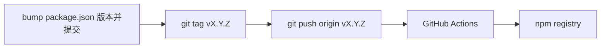

# 通过 GitHub 自动发布 npm

本仓库用 [`.github/workflows/publish-npm.yml`](../.github/workflows/publish-npm.yml) 在 **推送符合 SemVer 的 `v*` 标签** 时执行 `npm ci` → `npm run build` → `npm publish`。

## 流程概览

1. 在 `main`（或发版分支）上把 **`package.json` 的 `version`** 改成要发布的版本，并提交、推送代码。
2. 打标签：`git tag vX.Y.Z`（`v` 后的数字须与 `package.json` 的 `version` **完全一致**）。
3. 推送标签：`git push origin vX.Y.Z`。
4. Action 会校验 **tag 去掉 `v` 后** 与 `package.json` 一致，再发布；不一致则失败，避免发错版。

**手动重跑**：在 GitHub 仓库 **Actions → Publish to npm → Run workflow**（`workflow_dispatch`）可再跑一遍；仍使用当前分支上的 `package.json` 版本，若该版本已在 registry 存在会失败。

## 配置 NPM_TOKEN（推荐：GitHub Environment）

工作流中的发布 job 已绑定 **Environment：`npm`**，因此 **`NPM_TOKEN` 建议配置在环境 Secret** 中，便于使用审批、等待时间、部署分支/标签限制等（见 [Managing environments for deployment](https://docs.github.com/en/actions/how-tos/deploy/configure-and-manage-deployments/manage-environments)）。

1. 登录 [npm](https://www.npmjs.com/) → **Access Tokens**。
2. 创建 **Automation**（经典令牌）或具备 **Publish** 权限的 **Granular Access Token**，复制 token。
3. GitHub 仓库 → **Settings → Environments** → **New environment** → 名称填 **`npm`**（与 workflow 中 `environment.name` 一致）→ **Configure environment**。
4. 在 **Environment secrets** → **Add secret**：Name **`NPM_TOKEN`**，Value 粘贴 token。

**首次推送 tag 前**：若尚未创建环境，也可先跑一次 workflow（会按名称自动创建空环境），再到 **Environments → npm** 里补上 `NPM_TOKEN`。

**部署分支/标签**：若在环境里配置了 **Deployment branches and tags** 为「仅部分 ref」，请同时允许：

- **Tag**：如 `v*`（与 `push: tags: v*.*.*` 一致）；
- **Branch**：至少包含 **`main`**（否则 **Run workflow** 手动触发会因 ref 为分支而匹配不上环境规则，任务会卡住或失败）。

### 备选：仅仓库级 Secret

若不想用 Environment，可在 **Settings → Secrets and variables → Actions** → **New repository secret** 添加同名 **`NPM_TOKEN`**；同一 job 下环境 Secret 与仓库 Secret **同名时，环境 Secret 优先**。

勿将 token 写入仓库文件；本地 `~/.npmrc` 里的 token 也不要提交。

## 与本地 `npm publish` 的关系

| 方式 | 适用场景 |
|------|----------|
| **Tag 触发 CI** | 正式发版、可审计、与 Git 版本一一对应 |
| **本地 `npm publish`** | 紧急热修、或尚未配置 Secret 时 |

两者不要混用同一版本号：registry 上已存在的版本无法覆盖。

## 进阶：npm Trusted Publishing（可选）

npm 支持把 **GitHub 仓库** 登记为 [Trusted Publisher](https://docs.npmjs.com/trusted-publishers)，用 **OIDC** 换短期令牌，减少长期 `NPM_TOKEN` 泄露风险。启用后需在 Workflow 里改 `permissions`（如 `id-token: write`）并按 npm 文档配置 `npm publish` 的 provenance；当前工作流使用 **`NPM_TOKEN`** 即可工作，后续可再迁移。

## 验收清单

- [ ] 已在 **Environment `npm`**（或仓库 Actions）中添加 `NPM_TOKEN`  
- [ ] 若环境限制了部署 ref，已允许 `v*` 标签与 `main`（便于手动重跑）  
- [ ] 测试：`package.json` 已 bump → `git tag v…` → `git push origin v…` → Actions 绿 → `npm view claude-helper version` 更新  

## 排错：`ENEEDAUTH` / `need auth`

日志里若出现 **`npm error need auth`**、**`ENEEDAUTH`**：

1. **Secret 名称必须是 `NPM_TOKEN`**（与 workflow 里 `${{ secrets.NPM_TOKEN }}` 一致，区分大小写）。  
2. 当前 workflow 使用 **Environment `npm`**：请到 **Settings → Environments → npm → Environment secrets** 添加；也可在 **Actions → Repository secrets** 添加同名变量（环境优先）。  
3. 在 [npm Access Tokens](https://www.npmjs.com/settings/~/tokens) 新建 **Automation**（经典）或 **Granular Access Token**（勾选 **Publish**、包名选 `claude-helper`），复制后整段粘贴到 GitHub Secret。  
4. 若任务卡在 **Waiting for approval** 或环境不可用：检查该 Environment 是否启用了 **Required reviewers**；以及 **Deployment branches and tags** 是否放行当前触发用的 ref（tag 推送为 `refs/tags/v*`，手动 Run 多为 `main`）。  
5. 保存 Secret 后，在 **Actions** 里 **Re-run**；registry 已存在的版本不能重复发布，需 bump 版本再打新 tag。

工作流已增加「未配置 `NPM_TOKEN` 时直接失败并提示」的步骤，避免只看到含糊的 `ENEEDAUTH`。  
