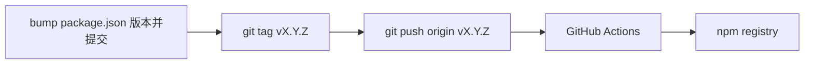

# 通过 GitHub 自动发布 npm

本仓库用 [`.github/workflows/publish-npm.yml`](../.github/workflows/publish-npm.yml) 在 **推送符合 SemVer 的 `v*` 标签** 时执行 `npm ci` → `npm run build` → `npm publish`。

## 流程概览

1. 在 `main`（或发版分支）上把 **`package.json` 的 `version`** 改成要发布的版本，并提交、推送代码。
2. 打标签：`git tag vX.Y.Z`（`v` 后的数字须与 `package.json` 的 `version` **完全一致**）。
3. 推送标签：`git push origin vX.Y.Z`。
4. Action 会校验 **tag 去掉 `v` 后** 与 `package.json` 一致，再发布；不一致则失败，避免发错版。

**手动重跑**：在 GitHub 仓库 **Actions → Publish to npm → Run workflow**（`workflow_dispatch`）可再跑一遍；仍使用当前分支上的 `package.json` 版本，若该版本已在 registry 存在会失败。

## 配置 GitHub Secret

1. 登录 [npm](https://www.npmjs.com/) → **Access Tokens**。
2. 创建 **Automation**（经典令牌）或具备 **Publish** 权限的 **Granular Access Token**，复制 token。
3. GitHub 仓库 → **Settings → Secrets and variables → Actions** → **New repository secret**。
4. Name：`NPM_TOKEN`，Value：粘贴 token。

勿将 token 写入仓库文件；本地 `~/.npmrc` 里的 token 也不要提交。

## 与本地 `npm publish` 的关系

| 方式 | 适用场景 |
|------|----------|
| **Tag 触发 CI** | 正式发版、可审计、与 Git 版本一一对应 |
| **本地 `npm publish`** | 紧急热修、或尚未配置 Secret 时 |

两者不要混用同一版本号：registry 上已存在的版本无法覆盖。

## 进阶：npm Trusted Publishing（可选）

npm 支持把 **GitHub 仓库** 登记为 [Trusted Publisher](https://docs.npmjs.com/trusted-publishers)，用 **OIDC** 换短期令牌，减少长期 `NPM_TOKEN` 泄露风险。启用后需在 Workflow 里改 `permissions`（如 `id-token: write`）并按 npm 文档配置 `npm publish` 的 provenance；当前工作流使用 **`NPM_TOKEN`** 即可工作，后续可再迁移。

## 验收清单

- [ ] 已添加 `NPM_TOKEN` Secret  
- [ ] 测试：`package.json` 已 bump → `git tag v…` → `git push origin v…` → Actions 绿 → `npm view claude-helper version` 更新  
