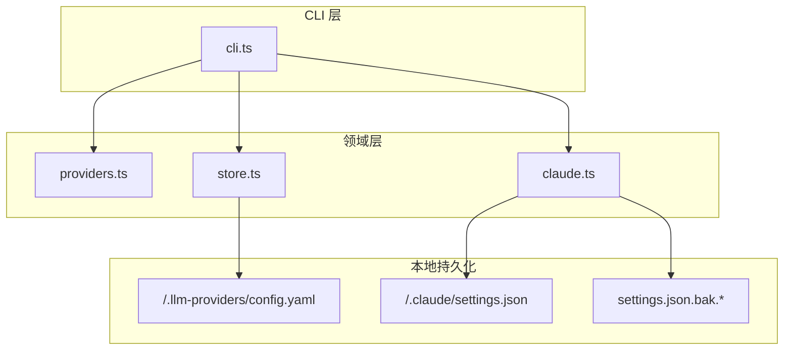
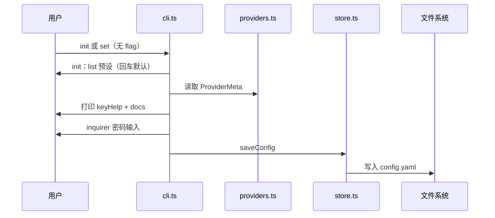
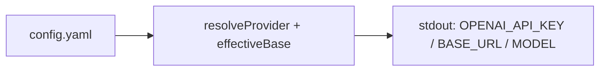
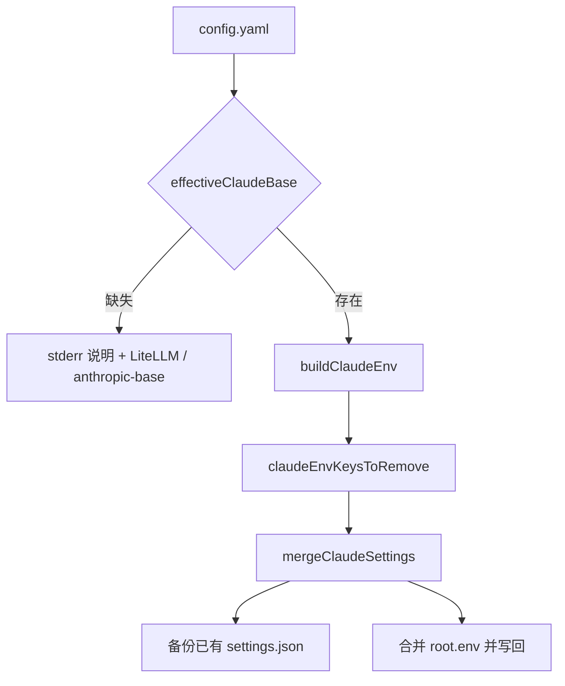

# llm-providers-config 技术设计文档

> 本文档面向技术分享与维护，侧重架构、数据流与实现细节。适用于代码评审、新贡献者上手或与 [openclaw-cursor-brain 技术文档](https://github.com/andeya/openclaw-cursor-brain/blob/main/doc/technical-guide-zh.md) 同级的内部对齐。

---

## 目录

- [第 1 章：项目概述](#第-1-章项目概述)
- [第 2 章：整体架构](#第-2-章整体架构)
- [第 3 章：数据流与关键路径](#第-3-章数据流与关键路径)
- [第 4 章：关键技术决策](#第-4-章关键技术决策)
- [第 5 章：模块设计](#第-5-章模块设计)
- [第 6 章：安装与配置](#第-6-章安装与配置)
- [第 7 章：使用指南](#第-7-章使用指南)
- [第 8 章：开发与贡献](#第-8-章开发与贡献)

---

## 第 1 章：项目概述

### 1.1 一句话定义

**llm-providers-config** 是一个 Node.js CLI（`llm-config`），在本地集中保存多家 LLM 供应商的 **API Key** 与可选 **Base URL**，并支持：

- 向 **OpenAI 兼容** 客户端导出 `OPENAI_*` 环境变量；
- 向 **Claude Code** 导出或合并 `ANTHROPIC_*` 到 `~/.claude/settings.json` 的 `env`。

产品形态上参考 [Z.AI Coding Tool Helper](https://docs.z.ai/devpack/extension/coding-tool-helper) 的向导与指引体验，但**刻意收窄**：不安装编码工具、不管理 MCP，只做密钥与对接说明。

### 1.2 解决的核心问题

| 问题 | 解决方案 |
|------|----------|
| 多供应商 Key 散落在各 shell 配置里 | 统一写入 `~/.llm-providers/config.yaml` |
| 用户不知道去哪申请 Key | 交互前打印 `keyHelp` + 官方 `docs` 链接 |
| Claude Code 需要 Anthropic 形态端点 | 内置 `claudeAnthropicBaseUrl` 或 `anthropic_base_url`（网关）；OpenAI-only 供应商报错引导 LiteLLM |
| 误覆盖用户 Claude 全局配置 | `claude apply` 仅合并 `env`，写入前备份 `settings.json.bak.<timestamp>` |

### 1.3 技术栈

| 组件 | 技术 | 说明 |
|------|------|------|
| 运行时 | Node.js ≥ 18 | ESM、`#!/usr/bin/env node` |
| 语言 | TypeScript | `tsc` 编译至 `dist/` |
| CLI | Commander | 子命令与 option |
| 交互 | Inquirer | 密码掩码、列表、多选 |
| 配置序列化 | js-yaml | 人类可读本地配置 |
| 终端输出 | chalk | 错误/提示着色 |

### 1.4 仓库结构

```
llm-providers-config/
├── package.json
├── tsconfig.json
├── README.md                 # 用户向快速上手
├── doc/
│   └── technical-guide-zh.md # 本文档
├── src/
│   ├── cli.ts                # 命令注册与业务编排
│   ├── providers.ts          # 供应商元数据与 ProviderId
│   ├── store.ts              # YAML 读写、脱敏
│   └── claude.ts             # Claude settings.json 合并与 ANTHROPIC_* 计算
└── dist/                     # 构建产物（git 可忽略）
```

---

## 第 2 章：整体架构

### 2.1 逻辑分层



### 2.2 与外部工具的关系

| 消费者 | 输入来源 | 协议/格式 |
|--------|----------|-----------|
| LiteLLM、curl、OpenAI SDK | `llm-config export` | Shell `export` 或 JSON |
| Claude Code | `llm-config claude apply` | [官方 settings `env`](https://docs.anthropic.com/en/docs/claude-code/settings) |

本工具**不**发起模型推理 HTTP 请求，仅读写本地文件与标准输出。

---

## 第 3 章：数据流与关键路径

### 3.1 配置写入（init / set）

`init` 第一步为 **list**（非 checkbox）：默认高亮「推荐：全部供应商」，**直接回车**即可；可选「仅 Claude 可一键 apply 的子集」或「自定义勾选」。面向新手，避免未按空格导致零选项退出。



### 3.2 OpenAI 导出路径



`effectiveBase`：`entry.base_url` 优先，否则 `PROVIDERS[id].defaultBaseUrl`。

### 3.3 Claude Code 应用路径



**Anthropic Base 解析优先级**：`entry.anthropic_base_url` → `meta.claudeAnthropicBaseUrl`。

**环境变量映射**：

- `claudeUseAuthToken === true`（OpenRouter）：`ANTHROPIC_AUTH_TOKEN` = Key，`ANTHROPIC_API_KEY` = `""`。
- 否则：`ANTHROPIC_API_KEY` = Key，并在合并前从 `env` 中删除 `ANTHROPIC_AUTH_TOKEN`，避免与上一供应商冲突。

---

## 第 4 章：关键技术决策

### 4.1 为何 YAML 而非 JSON？

| 方案 | 优点 | 缺点 |
|------|------|------|
| JSON | 工具普遍支持 | 手写注释差、多行密钥不友好 |
| **YAML** | 可读、可手改 | 需注意缩进错误 |
| Keychain | 更安全 | 跨平台与脚本化成本高 |

选择 YAML 平衡「个人开发者可编辑」与实现成本；生产环境若需更高安全可在外层用密钥管理替代明文文件。

### 4.2 为何不直接把 OpenAI Base 写入 ANTHROPIC_BASE_URL？

Claude Code 期望 **Anthropic Messages** 兼容端点。多数国内 OpenAI 兼容网关（Kimi、MiniMax、火山方舟等）与 Anthropic API 形态不一致。若静默映射会导致难以排查的 4xx/5xx。

**决策**：无内置 `claudeAnthropicBaseUrl` 的供应商，`claude apply` **失败并打印中文指引**，要求用户配置 LiteLLM 等后再设 `--anthropic-base`。

### 4.3 settings.json 合并策略

- **备份**：仅当 `settings.json` 已存在时 `copyFileSync` 到 `settings.json.bak.<Date.now()>`。
- **合并**：浅拷贝 `root.env`，先按 `removeKeys` 删除冲突键，再 `Object.assign(envPatch)`；`root` 其它顶层键（如 `permissions`）保持不变。
- **新建文件**：写入 `$schema: https://json.schemastore.org/claude-code-settings.json` 便于编辑器校验。

### 4.4 交互默认「仅 API Key」

与 Coding Tool Helper 一致，降低首次配置心智负担；高级项通过 `set --base`、`--anthropic-base`、`--model` 等非交互方式覆盖。

---

## 第 5 章：模块设计

### 5.1 `src/providers.ts`

| 职责 | 说明 |
|------|------|
| `ProviderId` | 联合字面量类型，与 YAML 中 key 一致 |
| `ProviderMeta` | `defaultBaseUrl`、`docs`、`keyHelp`、`claudeAnthropicBaseUrl?`、`claudeUseAuthToken?` |
| `PROVIDERS` | 单一数据源，扩展新供应商时只改此文件 |

### 5.2 `src/store.ts`

| 导出 | 说明 |
|------|------|
| `loadConfig` / `saveConfig` | 读写 `~/.llm-providers/config.yaml` |
| `ProviderEntry` | `api_key`、`base_url`、`anthropic_base_url`、`default_model`、`note` |
| `maskKey` | list/show 时脱敏 |

### 5.3 `src/claude.ts`

| 函数 | 说明 |
|------|------|
| `effectiveClaudeBase` | 网关覆盖 vs 内置 Anthropic Base |
| `buildClaudeEnv` | 生成待写入的 `ANTHROPIC_*` 键值 |
| `claudeEnvKeysToRemove` | 切换认证模式时清理残留键 |
| `mergeClaudeSettings` | 备份 + JSON 解析 + env 合并 + 写回 |

### 5.4 `src/cli.ts`

- 使用 Commander 注册：`list`、`show`、`set`、`unset`、`active`、`export`、`init`、`claude export`、`claude apply`。
- `resolveProvider`：`--provider` / `-p` 优先，否则 `active_provider`。
- `fatal`：统一 `process.exit(1)`。

---

## 第 6 章：安装与配置

### 6.1 安装

```bash
git clone <repo-url> llm-providers-config
cd llm-providers-config
npm install
npm run build
npm link   # 可选：全局 llm-config
```

### 6.2 涉及的文件路径

| 路径 | 用途 |
|------|------|
| `~/.llm-providers/config.yaml` | 本工具主配置 |
| `~/.claude/settings.json` | Claude Code 用户设置（`env` 被合并） |
| `~/.claude/settings.json.bak.*` | `apply` 前备份 |

### 6.3 环境变量（本工具不读取）

`llm-config` **不**读取 `HTTP_PROXY` 等；若未来增加在线校验 Key，可按 [Coding Tool Helper 排障说明](https://docs.z.ai/devpack/extension/coding-tool-helper) 在 Node 层设置代理。

---

## 第 7 章：使用指南

### 7.1 典型流程：Claude Code + 智谱

```bash
llm-config set glm --key <KEY>
llm-config active glm
llm-config claude apply
```

### 7.2 典型流程：Claude Code + OpenRouter

```bash
llm-config set openrouter --key <KEY>
llm-config active openrouter
llm-config claude apply
```

### 7.3 OpenAI-only 供应商 → Claude Code（LiteLLM）

1. `llm-config set kimi --key <KEY>`
2. 用 `llm-config export -p kimi` 中的 `OPENAI_*` 配置 LiteLLM 上游
3. 启动 LiteLLM 的 Anthropic 兼容监听
4. `llm-config set kimi --anthropic-base http://127.0.0.1:<端口>`
5. `llm-config claude apply -p kimi`

### 7.4 故障排查

| 现象 | 排查 |
|------|------|
| `claude apply` 报缺 Anthropic Base | 该供应商是否无内置 Anthropic URL；是否已 `--anthropic-base` |
| `settings.json 不是合法 JSON` | 手动修复或从 `settings.json.bak.*` 恢复 |
| 切换供应商后仍走旧认证 | 确认 `ANTHROPIC_AUTH_TOKEN` 是否已被本工具删除（OpenRouter → 智谱） |

---

## 第 8 章：开发与贡献

### 8.1 本地开发

```bash
npm install
npx tsx src/cli.ts list
npm run build
```

断点调试（Node 在首行暂停，等待附加调试器）：

```bash
npm run debug -- list
# 或带其它子命令：npm run debug -- claude export -p glm
```

在 Cursor / VS Code 使用「附加到 Node.js 进程」，或在 Chrome 打开 `chrome://inspect`。

### 8.2 新增供应商

1. 在 `ProviderId` 与 `PROVIDERS` 中增加条目。
2. 填写 `keyHelp`、`defaultBaseUrl`、`docs`；若官方提供 Anthropic 兼容，填 `claudeAnthropicBaseUrl` 与 `claudeUseAuthToken`。
3. 更新 `README.md` 供应商表与本文档相关章节。
4. `npm run build` 通过后提交。

### 8.3 设计原则（与 openclaw 文档对齐的表述）

| 原则 | 含义 | 实践 |
|------|------|------|
| 单一职责 | 只做配置与导出 | 不嵌套代理、不装 MCP |
| 显式失败 | 不猜测错误 Base | OpenAI-only 无网关则退出并说明 |
| 可恢复 | 用户配置珍贵 | `apply` 必备份已存在文件 |
| 可扩展 | 新厂商低成本 | 元数据驱动 `providers.ts` |

---

## 附录：标识符与常量速查

| 标识符 | 说明 |
|--------|------|
| `CONFIG_DIR` | `~/.llm-providers`（见 `store.ts`） |
| `CONFIG_PATH` | `~/.llm-providers/config.yaml` |
| `SETTINGS_SCHEMA` | `https://json.schemastore.org/claude-code-settings.json` |
| `bin` | `llm-config` → `dist/cli.js` |

---

## 外部参考

- [Claude Code settings](https://docs.anthropic.com/en/docs/claude-code/settings)
- [OpenRouter × Claude Code](https://openrouter.ai/docs/guides/guides/coding-agents/claude-code-integration)
- [Z.AI Coding Tool Helper](https://docs.z.ai/devpack/extension/coding-tool-helper)
- [openclaw-cursor-brain technical-guide-zh.md](https://github.com/andeya/openclaw-cursor-brain/blob/main/doc/technical-guide-zh.md)（文档结构参考）
