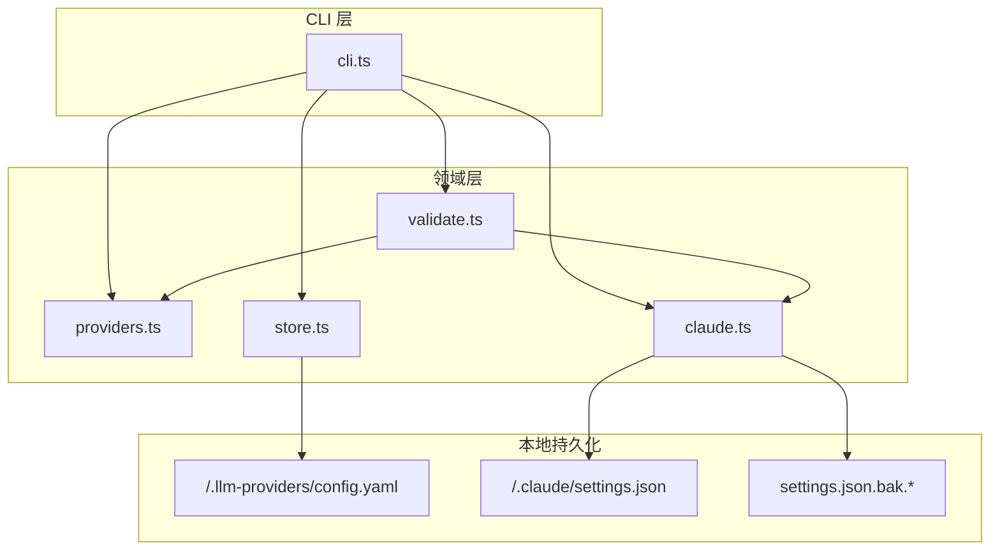
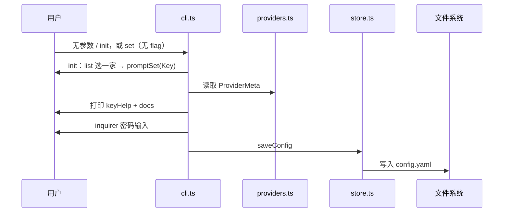
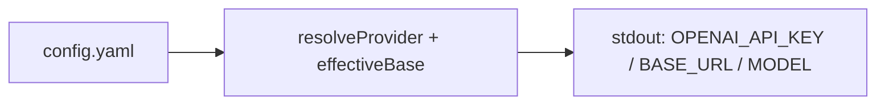
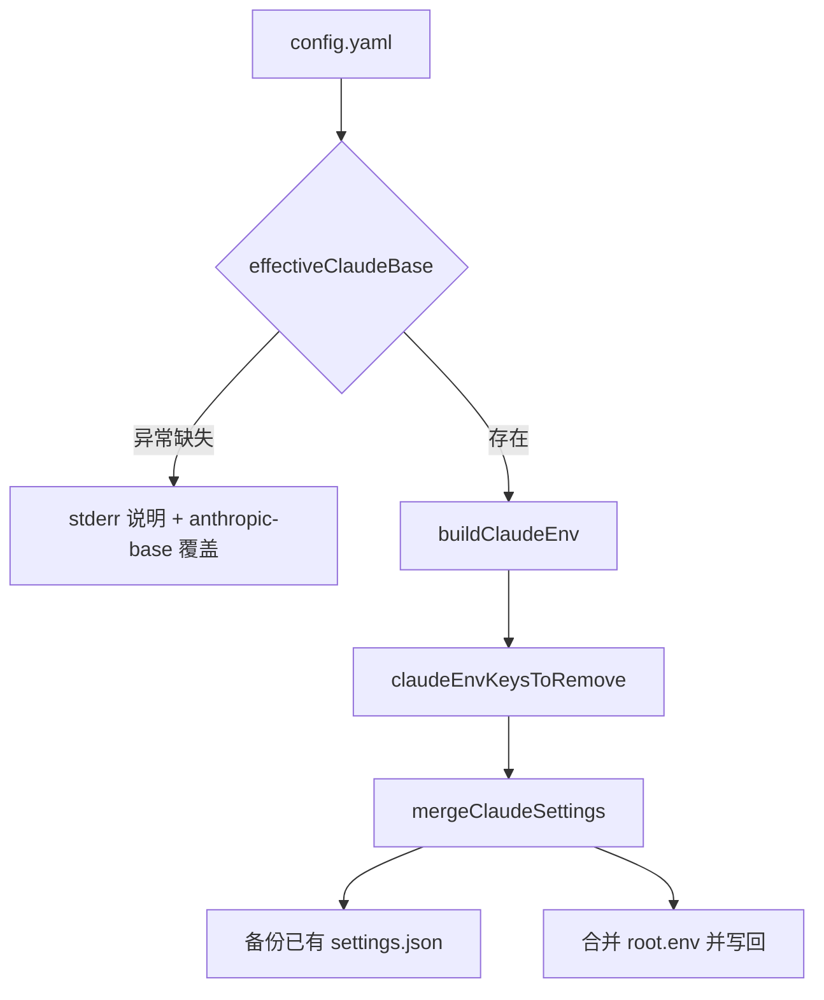

# Claude Helper 技术设计文档

> 本文档面向技术分享与维护，侧重架构、数据流与实现细节。适用于代码评审、新贡献者上手或与 [openclaw-cursor-brain 技术文档](https://github.com/andeya/openclaw-cursor-brain/blob/main/doc/technical-guide-zh.md) 同级的内部对齐。

**厂商官方文档索引**（MiniMax、智谱一键助手、Kimi、火山、OpenRouter、Z.AI 等）：[vendor-docs-zh.md](./vendor-docs-zh.md)。

---

## 目录

- [第 1 章：项目概述](#第-1-章项目概述)
- [第 2 章：整体架构](#第-2-章整体架构)
- [第 3 章：数据流与关键路径](#第-3-章数据流与关键路径)
- [第 4 章：关键技术决策](#第-4-章关键技术决策)
- [第 5 章：模块设计](#第-5-章模块设计)
- [第 6 章：安装与配置](#第-6-章安装与配置)
- [第 7 章：使用指南](#第-7-章使用指南)（含故障排查 §7.5）
- [第 8 章：开发与贡献](#第-8-章开发与贡献)

---

## 第 1 章：项目概述

### 1.1 一句话定义

**Claude Helper**（npm 包名 `claude-helper`，命令 `claude-helper`，源码仓库 [github.com/day253/claude-helper](https://github.com/day253/claude-helper)）是一个 Node.js CLI，在本地集中保存多家 LLM 供应商的 **API Key** 与可选 **Base URL**，并支持：

- 向 **OpenAI 兼容** 客户端导出 `OPENAI_*` 环境变量；
- 向 **Claude Code** 导出或合并 `ANTHROPIC_*` 到 `~/.claude/settings.json` 的 `env`。

产品形态上与智谱 [一键安装助手](https://docs.bigmodel.cn/cn/coding-plan/extension/coding-tool-helper#)（`@z_ai/coding-helper`）的向导体验相近，但**刻意收窄**：不安装编码工具、不管理 MCP，只做密钥与对接说明；完整装机与套餐规则请以 **[vendor-docs-zh.md](./vendor-docs-zh.md)** 中的官方链接为准。

### 1.2 解决的核心问题

| 问题 | 解决方案 |
|------|----------|
| 多供应商 Key 散落在各 shell 配置里 | 统一写入 `~/.llm-providers/config.yaml` |
| 用户不知道去哪申请 Key | 交互前打印 `keyHelp` + 官方 `docs` 链接 |
| Claude Code 需要 Anthropic 形态端点 | **仅收录**厂商文档给出的 `claudeAnthropicBaseUrl`（当前见 `PROVIDER_IDS`）；可用 `anthropic_base_url` 覆盖；链接汇总见 [vendor-docs-zh.md](./vendor-docs-zh.md) |
| 误覆盖用户 Claude 全局配置 | `claude apply` 仅合并 `env`，写入前备份 `settings.json.bak.<timestamp>` |

### 1.3 技术栈

| 组件 | 技术 | 说明 |
|------|------|------|
| 运行时 | Node.js ≥ 18 | ESM、`#!/usr/bin/env node` |
| 语言 | TypeScript | `tsc` 编译至 `dist/` |
| CLI | Commander | 子命令与 option |
| 交互 | Inquirer | 密码掩码、列表、多选 |
| 配置序列化 | js-yaml | 人类可读本地配置 |
| 终端输出 | chalk | 错误/提示着色 |

### 1.4 仓库结构

```
claude-helper/   # 仓库目录名可与包名不同
├── package.json
├── tsconfig.json
├── README.md                 # 用户向快速上手
├── doc/
│   ├── technical-guide-zh.md # 本文档
│   └── vendor-docs-zh.md     # 厂商官方文档索引（Claude Code / 套餐）
├── src/
│   ├── cli.ts                # 命令注册与业务编排、runSetupWizard
│   ├── ui.ts                 # 向导横幅、警告、摘要（对齐 coding-helper 式引导）
│   ├── version.ts            # package.json 版本（commander -V）
│   ├── providers.ts          # 供应商元数据与 ProviderId
│   ├── store.ts              # YAML 读写、脱敏
│   ├── claude.ts             # settings.json 合并、ANTHROPIC_*、effectiveOpenAIBase
│   └── validate.ts           # 保存后检查、网络探测、启动 Claude 提示
└── dist/                     # 构建产物（git 可忽略）
```

---

## 第 2 章：整体架构

### 2.1 逻辑分层



### 2.2 与外部工具的关系

| 消费者 | 输入来源 | 协议/格式 |
|--------|----------|-----------|
| LiteLLM、curl、OpenAI SDK | `claude-helper export` | Shell `export` 或 JSON |
| Claude Code | `claude-helper claude apply` | [官方 settings `env`](https://docs.anthropic.com/en/docs/claude-code/settings) |

本工具**不**发起模型推理 HTTP 请求，仅读写本地文件与标准输出。

---

## 第 3 章：数据流与关键路径

### 3.1 配置写入（init / set）

无子命令运行 `claude-helper` 与 `claude-helper init` 相同：**第一步 `list` 选唯一供应商**（默认高亮 `glm`），**第二步** `promptSet`（打印该家 `docs` + `keyHelp` 后输入 Key），`active_provider` 设为所选 id。



### 3.2 OpenAI 导出路径



`effectiveBase`：`entry.base_url` 优先，否则 `PROVIDERS[id].defaultBaseUrl`。

### 3.3 Claude Code 应用路径



**Anthropic Base 解析优先级**：`entry.anthropic_base_url` → `meta.claudeAnthropicBaseUrl`。

**环境变量映射**：

- `claudeUseAuthToken === true`（OpenRouter）：`ANTHROPIC_AUTH_TOKEN` = Key，`ANTHROPIC_API_KEY` = `""`。
- 否则：`ANTHROPIC_API_KEY` = Key，并在合并前从 `env` 中删除 `ANTHROPIC_AUTH_TOKEN`，避免与上一供应商冲突。

---

## 第 4 章：关键技术决策

### 4.1 为何 YAML 而非 JSON？

| 方案 | 优点 | 缺点 |
|------|------|------|
| JSON | 工具普遍支持 | 手写注释差、多行密钥不友好 |
| **YAML** | 可读、可手改 | 需注意缩进错误 |
| Keychain | 更安全 | 跨平台与脚本化成本高 |

选择 YAML 平衡「个人开发者可编辑」与实现成本；生产环境若需更高安全可在外层用密钥管理替代明文文件。

### 4.2 供应商目录策略

Claude Code 需要 **Anthropic Messages** 兼容端点。仅 OpenAI 兼容、无官方 Anthropic 根或文档的渠道**不列入** `PROVIDERS`，避免用户误以为可一键 `claude apply`。

**决策**：新供应商须在厂商文档中核实可用的 Anthropic 兼容根 URL，并写入 [vendor-docs-zh.md](./vendor-docs-zh.md)；老配置里未知 id 在 `loadConfig` 时会被忽略。部分厂商还会在 `env` 中要求额外键（超时、模型别名等），通过 `ProviderMeta.claudeExtraEnv` 描述；`claude apply` 前会统一清除**所有**供应商在 `claudeExtraEnv` 中声明过的键名，再写入当前供应商的补丁，避免切换后残留。

### 4.3 settings.json 合并策略

- **备份**：仅当 `settings.json` 已存在时 `copyFileSync` 到 `settings.json.bak.<Date.now()>`。
- **合并**：浅拷贝 `root.env`，先按 `removeKeys` 删除冲突键，再 `Object.assign(envPatch)`；`root` 其它顶层键（如 `permissions`）保持不变。
- **新建文件**：写入 `$schema: https://json.schemastore.org/claude-code-settings.json` 便于编辑器校验。

### 4.4 交互默认「仅 API Key」

与 Coding Tool Helper 一致，降低首次配置心智负担；高级项通过 `set --base`、`--anthropic-base`、`--model` 等非交互方式覆盖。

---

## 第 5 章：模块设计

### 5.1 `src/providers.ts`

| 职责 | 说明 |
|------|------|
| `ProviderId` | 联合字面量类型，与 YAML 中 key 一致 |
| `ProviderMeta` | `defaultBaseUrl`、`docs`、`keyHelp`、**必填** `claudeAnthropicBaseUrl`、`claudeUseAuthToken?`、`claudeExtraEnv?`（厂商文档要求的附加 `ANTHROPIC_*` / 超时等） |
| `PROVIDERS` | 单一数据源，扩展新供应商时只改此文件 |
| `PROVIDER_IDS` / `PROVIDER_IDS_WIZARD` | 全部 id；向导列表 **glm 置顶** 其余字母序，避免 `Object.keys` 顺序随对象字面量变化 |

### 5.2 `src/store.ts`

| 导出 | 说明 |
|------|------|
| `loadConfig` / `saveConfig` | 读写 `~/.llm-providers/config.yaml`；`loadConfig` 只保留当前 `ProviderId`，并校验 `active_provider` |
| `ProviderEntry` | `api_key`、`base_url`、`anthropic_base_url`、`default_model`、`note` |
| `maskKey` | list/show 时脱敏 |

### 5.3 `src/claude.ts`

| 函数 | 说明 |
|------|------|
| `effectiveOpenAIBase` | OpenAI 兼容 `export` 用 Base URL |
| `effectiveClaudeBase` | 网关覆盖 vs 内置 Anthropic Base |
| `buildClaudeEnv` | 生成待写入的 `ANTHROPIC_*` 键值 |
| `claudeEnvKeysToRemove` | 合并前删除：全部 `claudeExtraEnv` 曾用过的键名、按需删 `ANTHROPIC_AUTH_TOKEN` / `ANTHROPIC_MODEL` |
| `mergeClaudeSettings` | 备份 + JSON 解析 + env 合并 + 写回 |

### 5.4 `src/validate.ts`

| 导出 | 说明 |
|------|------|
| `probeUrl` | `fetch` + 超时，用于判断 API 根路径是否可达（不校验厂商鉴权） |
| `validateAfterSave` | `init` / `set` / `active` 保存后及 `check` 命令：列出已填 Key、**仅**对默认供应商的 **Anthropic 兼容根** 做 HTTP 探测（OpenAI export Base 不探测）、`buildClaudeEnv` 试组装，并打印启动 Claude Code 的步骤 |

### 5.5 `src/cli.ts`

- 使用 Commander 注册：`list`、`show`、`set`、`unset`、`active`、`export`、`check`、`init`、`claude export`、`claude apply`。
- 无参 / `init`：`runSetupWizard()` **循环主菜单**（参考 `@z_ai/coding-helper` 的层级与文案习惯）：配置 Key、仅 apply、仅 check、退出；写入 `~/.claude/settings.json` 前有 **Warning + confirm**；`src/ui.ts` 负责横幅、分区标题、导航提示。
- `resolveProvider`：`--provider` / `-p` 优先，否则 `active_provider`。
- `fatal`：统一 `process.exit(1)`。
- `version.ts`：从 `package.json` 读取版本供 `commander -V` 使用。

### 5.6 `src/ui.ts`

| 导出 | 说明 |
|------|------|
| `printWizardBanner` | 顶部双线框标题 |
| `printClaudeGlobalWarning` | 修改用户级 Claude 配置的黄色警告 |
| `printConfigSyncSummary` | 保存 Key 后的「配置摘要」（脱敏、Anthropic 根） |
| `printNavHint` / `printOfficialHelperHint` | 键位说明与官方 coding-helper 分流提示 |

---

## 第 6 章：安装与配置

### 6.1 安装

```bash
git clone <repo-url> claude-helper
cd claude-helper
npm install
npm run build
npm link   # 可选：全局 claude-helper
```

### 6.2 涉及的文件路径

| 路径 | 用途 |
|------|------|
| `~/.llm-providers/config.yaml` | 本工具主配置 |
| `~/.claude/settings.json` | Claude Code 用户设置（`env` 被合并） |
| `~/.claude/settings.json.bak.*` | `apply` 前备份 |

### 6.3 环境变量（本工具不读取）

`claude-helper` **不**读取 `HTTP_PROXY` 等；若未来增加在线校验 Key，可按 [Coding Tool Helper 排障说明](https://docs.z.ai/devpack/extension/coding-tool-helper) 在 Node 层设置代理。

---

## 第 7 章：使用指南

### 7.1 典型流程：Claude Code + 智谱

```bash
claude-helper set glm --key <KEY>
claude-helper active glm
claude-helper claude apply
```

### 7.2 典型流程：Claude Code + OpenRouter

```bash
claude-helper set openrouter --key <KEY>
claude-helper active openrouter
claude-helper claude apply
```

### 7.3 典型流程：Claude Code + MiniMax

```bash
claude-helper set minimax --key <KEY>
# 中国大陆用户：
# claude-helper set minimax --key <KEY> --anthropic-base https://api.minimaxi.com/anthropic
claude-helper active minimax
claude-helper claude apply
```

### 7.4 典型流程：Z.AI（国际）/ Kimi（Moonshot）/ 火山方舟

```bash
# Z.AI（GLM Coding Plan，国际站）
claude-helper set zai --key <KEY>
claude-helper active zai
claude-helper claude apply

# Kimi（默认国际 Anthropic 根；中国大陆可加 --anthropic-base https://api.moonshot.cn/anthropic）
claude-helper set moonshot --key <KEY>
claude-helper active moonshot
claude-helper claude apply

# 火山方舟 Coding Plan（默认北京区 /api/coding，以官方文档为准）
claude-helper set volcengine --key <KEY>
claude-helper active volcengine
claude-helper claude apply
```

官方链接与套餐要求见 [vendor-docs-zh.md](./vendor-docs-zh.md)。

### 7.5 故障排查

| 现象 | 排查 |
|------|------|
| `claude apply` 报缺 Anthropic Base | 配置是否损坏；尝试 `set <id> --anthropic-base` 覆盖 |
| `settings.json 不是合法 JSON` | 手动修复或从 `settings.json.bak.*` 恢复 |
| 切换供应商后仍走旧认证 | 确认 `ANTHROPIC_AUTH_TOKEN` / `ANTHROPIC_API_KEY` 是否与当前厂商文档一致；环境变量优先级高于 `settings.json` 时需先清理 shell 中的冲突项 |

---

## 第 8 章：开发与贡献

### 8.1 本地开发

```bash
npm install
npx tsx src/cli.ts list
npm run build
```

断点调试（Node 在首行暂停，等待附加调试器）：

```bash
npm run debug -- list
# 或带其它子命令：npm run debug -- claude export -p glm
```

在 Cursor / VS Code 使用「附加到 Node.js 进程」，或在 Chrome 打开 `chrome://inspect`。

### 8.2 新增供应商

1. 在 `ProviderId` 与 `PROVIDERS` 中增加条目（须已核实 **Anthropic 兼容根 URL**）。
2. 填写 `keyHelp`、`defaultBaseUrl`、`docs`、**必填** `claudeAnthropicBaseUrl`，按需 `claudeUseAuthToken`、`claudeExtraEnv`。
3. 更新 `README.md` 供应商表与本文档相关章节。
4. `npm run build` 通过后提交。

### 8.3 设计原则（与 openclaw 文档对齐的表述）

| 原则 | 含义 | 实践 |
|------|------|------|
| 单一职责 | 只做配置与导出 | 不嵌套代理、不装 MCP |
| 显式失败 | 不猜测错误 Base | OpenAI-only 无网关则退出并说明 |
| 可恢复 | 用户配置珍贵 | `apply` 必备份已存在文件 |
| 可扩展 | 新厂商低成本 | 元数据驱动 `providers.ts` |

---

## 附录：标识符与常量速查

| 标识符 | 说明 |
|--------|------|
| `CONFIG_DIR` | `~/.llm-providers`（见 `store.ts`） |
| `CONFIG_PATH` | `~/.llm-providers/config.yaml` |
| `SETTINGS_SCHEMA` | `https://json.schemastore.org/claude-code-settings.json` |
| `bin` | `claude-helper`（`package.json`）→ `dist/cli.js` |

---

## 外部参考

- **[本仓库 vendor-docs-zh.md](./vendor-docs-zh.md)**：按供应商整理的官方文档（含 [智谱一键安装助手](https://docs.bigmodel.cn/cn/coding-plan/extension/coding-tool-helper#)、[智谱 Claude Code](https://docs.bigmodel.cn/cn/coding-plan/tool/claude)、[MiniMax Claude Code](https://platform.minimax.io/docs/token-plan/claude-code) 等）
- [Claude Code settings](https://docs.anthropic.com/en/docs/claude-code/settings)
- [openclaw-cursor-brain technical-guide-zh.md](https://github.com/andeya/openclaw-cursor-brain/blob/main/doc/technical-guide-zh.md)（文档结构参考）
